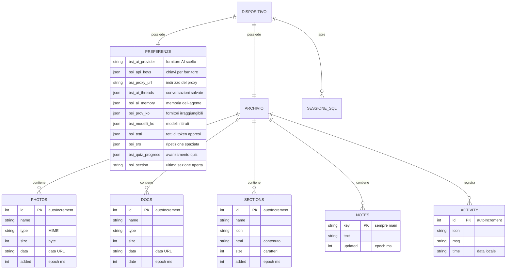

# Data Model — BioSpecInfo

| Field | Value |
|-------|--------|
| **Software** | BioSpecInfo |
| **Version described** | `bsi-v174` |
| **Purpose** | Document where the data live, with what structure, and what lifecycle they have. |

---

## 0. A necessary premise

**BioSpecInfo has no server database.** There is no backend, so there are no
centrally managed relational tables, no migrations, and no users stored
anywhere.

There is, however, a real data model, and an assessor is entitled to see it
documented. It is organised across three levels:

| Level | Technology | What it holds | Where it lives |
|---|---|---|---|
| **Preferences and progress** | `localStorage` | Settings, API keys, AI history, study progress | The user's browser |
| **Document archive** | IndexedDB | Photos, documents, HTML sections, notes, activity log | The user's browser |
| **Teaching datasets** | SQLite via `sql.js` | Exercise tables, created in memory at each session | Memory, not persisted |

**All data stay on the device.** They are not transmitted, there is no
server-side user identifier, and the user can delete them selectively from the
interface.

---

## 1. Entity diagram

> The diagram keeps the entity and field names as they appear in the code, in
> Italian: renaming them in the translation would document a model that does not
> exist.

---

## 2. Preferences and state — `localStorage`

### 2.1 AI assistant

| Key | Type | Content | Lifecycle |
|---|---|---|---|
| `bsi_ai_provider` | string | Identifier of the selected provider | Until the user changes it |
| `bsi_api_keys` | JSON | `{ providerId: key }` | Until explicitly deleted |
| `bsi_api_key` | string | Single key, legacy format | Migrated to `bsi_api_keys` |
| `bsi_proxy_url` | string | Proxy address | Until "Disconnect" |
| `bsi_ai_threads` | JSON | `{ threads: [...], activeId }` — max **30 chats**, **100 messages** each | Pruned automatically |
| `bsi_ai_memory` | JSON | Facts the agent remembers between sessions | Deletable |
| `bsi_ai_history` | JSON | Condensed history | Deletable |
| `bsi_nucleo` | string | "Core" mode active | — |

### 2.2 What the assistant learns about providers

These three keys are the reason the assistant improves with use instead of
repeating the same mistakes. They have an expiry because today's failure must
not be a permanent sentence.

| Key | Structure | Expiry | What it is for |
|---|---|---|---|
| `bsi_prov_ko` | `{ providerId: { t: epoch, n: count } }` | **24 hours** | Providers that do not answer from this device. Demoted in the selection, never removed. |
| `bsi_modelli_ko` | `{ digest: { modelli: [...], t } }` | **7 days** | Models retired by the provider, so as not to offer them again. Indexed on the digest of the key. |
| `bsi_tetti` | `{ providerId: tokenCeiling }` | Permanent | Token ceiling learned from the error message rather than hard-coded |

### 2.3 Study and progress

| Key | Content |
|---|---|
| `bsi_srs` | Spaced repetition: cards, intervals, next review |
| `bsi_sm2` | Parameters of the SM-2 algorithm |
| `bsi_quiz_progress`, `bsi_quiz_history` | Quiz progress and history |
| `bsi_studypath` | The study path chosen |
| `bsi_notes`, `bsi_note_<section>` | Personal notes, global and per section |
| `bsi_ds_prog`, `bsi_ds_proj` | Progress in the data-science module |
| `bsi_section` | Last section opened, to resume from there |
| `bsi_guide_v3` | Introductory guide already seen |

### 2.4 Identifiers and licence

| Key | Content | Privacy note |
|---|---|---|
| `bsi_device_id` | Random local identifier | **Not transmitted.** It only distinguishes installations within the same browser. |
| `bsi_user_email` | Email, if entered by the user | Entered voluntarily, not transmitted |
| `bsi_pro_license`, `bsi_trial_start` | State of Pro mode | Local |
| `bsi_rdkit_lib2` | Molecule library of the laboratory | Local |

> That none of these ever leaves the device is verified directly by
> `audit_rete`, which seeds a canary value into these very keys and then
> inspects every outgoing request.

---

## 3. Document archive — IndexedDB

| | |
|---|---|
| **Database name** | `bsi_filemanager_v1` |
| **Schema version** | `2` |
| **Object stores** | `photos`, `docs`, `sections`, `notes`, `activity` |

### 3.1 Structure of the stores

| Store | Key | Fields | Notes |
|---|---|---|---|
| `photos` | `id` (autoIncrement) | `name`, `type`, `size`, `data`, `added` | Images as data URLs. Per-file limit: **20 MB** |
| `docs` | `id` (autoIncrement) | `name`, `type`, `size`, `data`, `date` | Generic documents |
| `sections` | `id` (autoIncrement) | `name`, `icon`, `html`, `size`, `added` | HTML pages uploaded by the user |
| `notes` | `key` | `key` (`"main"`), `text`, `updated` | A single entry |
| `activity` | `id` (autoIncrement) | `icon`, `msg`, `time` | Log of the most recent operations |

> The `files` store, present in earlier schema versions, is no longer created
> from version 2.

### 3.2 Opening and unavailability

Opening IndexedDB is **asynchronous**, and in some configurations (Safari in
private browsing, site data blocked) it **never happens**. The code awaits a
promise rather than reading a variable that might not yet be set, and
distinguishes two cases:

- **reading** with the store absent → returns an empty set, the page shows
  "nothing yet";
- **writing** with the store absent → the error reaches whoever pressed the
  button, and a persistent warning appears at the top of the page saying nothing
  will be kept.

If another tab requests a version upgrade, the connection is closed
(`onversionchange`) so as not to block both.

---

## 4. Teaching datasets — SQLite in memory

The data-exercise module creates an SQLite database **in memory** through
`sql.js` (SQLite compiled to WebAssembly). The tables are generated at each
session from the datasets bundled in the repository and are **not persisted**:
closing the tab makes them vanish.

The choice is deliberate: the exercise must start from a known state every time,
and no user data end up in a database they did not create.

---

## 5. Reference data — constants in the code

The scientific data are not in a database but in constant structures inside
`index.html`, loaded with the application. They are read-only and versioned
together with the code.

| Structure | Content | Verification |
|---|---|---|
| `FARM_DATA` | **178 drugs**: name, category, SMILES, molecular weight, mechanism of action, indications, adverse effects, class | `tools/verifica-farmaci.js` — structure ⟷ molecular weight |
| `UV_DATA` | Chromophores, λmax, extinction coefficients, Woodward's rules | `audit_dati` |
| `MS_DATA` | Characteristic fragmentations by class | `audit_dati` |
| `MOLECOLE_ESAME` | Tabulated exam molecules | `test_spettri` |
| `PHYS_SIMBOLI` | Physical constants with symbol and unit | `test_costanti` |
| `SMARTS`, `SMARTS_H` | Patterns for functional-group recognition | `test_spettri` |

---

## 6. Lifecycle and deletion

The user can delete data **by group**, from the interface, without wiping
everything. The groups are defined in `bsiCancellaDati()`.

| Group | What it removes |
|---|---|
| `chiavi` | API keys, chosen provider, proxy address, memory of unreachable providers |
| `chat` | Conversations and the assistant's memory |
| `studio` | Spaced repetition, quizzes, study path, notes |
| `tutto` | Every `bsi_*` key and the entire IndexedDB archive |

Deleting the archive proceeds even if a single entry fails, and reports how many
were not removed: a "delete everything" operation that stops halfway without
saying so would be worse than the problem it solves.

---

## 7. Retention and space limits

| Constraint | Value | Behaviour when exceeded |
|---|---|---|
| `localStorage` | 5–10 MB depending on the browser | Writes fail. The app stays operational: chats are pruned (30 chats, 100 messages), and every write is guarded. |
| IndexedDB | Quota granted by the browser | Error reported to whoever pressed, with a persistent warning |
| Single image | 20 MB | Refused with an explicit message; the upload of the others continues |

Behaviour with space exhausted is verified by the `audit_quota` and
`test_filemanager` benches: ten pages out of ten stay usable with
`localStorage.setItem` forced to fail.

---

_Document updated to version `bsi-v174`._
