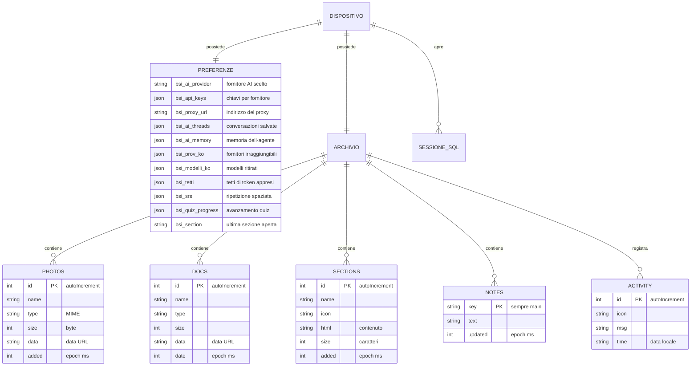

# Modello dei dati — BioSpecInfo

| Campo | Valore |
|-------|--------|
| **Software** | BioSpecInfo |
| **Versione descritta** | `bsi-v167` |
| **Scopo** | Documentare dove risiedono i dati, con quale struttura, e quale ciclo di vita hanno. |

---

## 0. Premessa necessaria

**BioSpecInfo non ha un database su server.** Non esiste un backend, quindi non
esistono tabelle relazionali gestite centralmente, migrazioni, o utenti
memorizzati da qualche parte.

Esiste però un modello dei dati reale, e un valutatore ha diritto di vederlo
documentato. Si articola su tre livelli:

| Livello | Tecnologia | Cosa contiene | Dove vive |
|---|---|---|---|
| **Preferenze e progressi** | `localStorage` | Impostazioni, chiavi API, cronologia AI, avanzamento nello studio | Browser dell'utente |
| **Archivio documenti** | IndexedDB | Foto, documenti, sezioni HTML, note, registro attività | Browser dell'utente |
| **Dataset didattici** | SQLite via `sql.js` | Tabelle di esercitazione, create in memoria a ogni sessione | Memoria, non persistito |

**Tutti i dati restano sul dispositivo.** Non vengono trasmessi, non esiste un
identificativo utente lato server, e l'utente può cancellarli selettivamente
dall'interfaccia.

---

## 1. Diagramma delle entità

---

## 2. Preferenze e stato — `localStorage`

### 2.1 Assistente AI

| Chiave | Tipo | Contenuto | Ciclo di vita |
|---|---|---|---|
| `bsi_ai_provider` | stringa | Identificativo del fornitore selezionato | Finché l'utente non cambia |
| `bsi_api_keys` | JSON | `{ idFornitore: chiave }` | Fino a cancellazione esplicita |
| `bsi_api_key` | stringa | Chiave singola, formato storico | Migrata a `bsi_api_keys` |
| `bsi_proxy_url` | stringa | Indirizzo del proxy | Fino a «Scollega» |
| `bsi_ai_threads` | JSON | `{ threads: [...], activeId }` — max **30 chat**, **100 messaggi** ciascuna | Potatura automatica |
| `bsi_ai_memory` | JSON | Fatti che l'agente ricorda fra le sessioni | Cancellabile |
| `bsi_ai_history` | JSON | Cronologia sintetica | Cancellabile |
| `bsi_nucleo` | stringa | Modalità «nucleo» attiva | — |

### 2.2 Ciò che l'assistente impara sui fornitori

Queste tre chiavi sono il motivo per cui l'assistente migliora con l'uso invece
di ripetere gli stessi errori. Hanno una scadenza perché un guasto di oggi non
deve essere una condanna definitiva.

| Chiave | Struttura | Scadenza | A cosa serve |
|---|---|---|---|
| `bsi_prov_ko` | `{ idFornitore: { t: epoch, n: conteggio } }` | **24 ore** | Fornitori che da questo dispositivo non rispondono. Retrocessi nella scelta, mai rimossi. |
| `bsi_modelli_ko` | `{ impronta: { modelli: [...], t } }` | **7 giorni** | Modelli ritirati dal fornitore, per non riproporli. Indicizzati sull'impronta della chiave. |
| `bsi_tetti` | `{ idFornitore: tettoToken }` | Permanente | Tetto di token appreso dal messaggio d'errore, anziché codificato |

### 2.3 Studio e progressi

| Chiave | Contenuto |
|---|---|
| `bsi_srs` | Ripetizione spaziata: schede, intervalli, prossima revisione |
| `bsi_sm2` | Parametri dell'algoritmo SM-2 |
| `bsi_quiz_progress`, `bsi_quiz_history` | Avanzamento e storico dei quiz |
| `bsi_studypath` | Percorso di studio scelto |
| `bsi_notes`, `bsi_note_<sezione>` | Note personali, globali e per sezione |
| `bsi_ds_prog`, `bsi_ds_proj` | Avanzamento del modulo di data science |
| `bsi_section` | Ultima sezione aperta, per riprendere da lì |
| `bsi_guide_v3` | Guida introduttiva già vista |

### 2.4 Identificativi e licenza

| Chiave | Contenuto | Nota sulla riservatezza |
|---|---|---|
| `bsi_device_id` | Identificativo casuale locale | **Non viene trasmesso.** Serve solo a distinguere le installazioni sullo stesso browser. |
| `bsi_user_email` | Email, se inserita dall'utente | Inserita volontariamente, non trasmessa |
| `bsi_pro_license`, `bsi_trial_start` | Stato della modalità Pro | Locale |
| `bsi_rdkit_lib2` | Libreria molecole del laboratorio | Locale |

---

## 3. Archivio documenti — IndexedDB

| | |
|---|---|
| **Nome database** | `bsi_filemanager_v1` |
| **Versione schema** | `2` |
| **Object store** | `photos`, `docs`, `sections`, `notes`, `activity` |

### 3.1 Struttura degli store

| Store | Chiave | Campi | Note |
|---|---|---|---|
| `photos` | `id` (autoIncrement) | `name`, `type`, `size`, `data`, `added` | Immagini come data URL. Limite per file: **20 MB** |
| `docs` | `id` (autoIncrement) | `name`, `type`, `size`, `data`, `date` | Documenti generici |
| `sections` | `id` (autoIncrement) | `name`, `icon`, `html`, `size`, `added` | Pagine HTML caricate dall'utente |
| `notes` | `key` | `key` (`"main"`), `text`, `updated` | Voce unica |
| `activity` | `id` (autoIncrement) | `icon`, `msg`, `time` | Registro delle ultime operazioni |

> Lo store `files`, presente in versioni precedenti dello schema, non è più
> creato dalla versione 2.

### 3.2 Apertura e indisponibilità

L'apertura di IndexedDB è **asincrona**, e in alcune configurazioni (Safari in
navigazione privata, dati dei siti bloccati) **non avviene mai**. Il codice
attende una promessa anziché leggere una variabile che potrebbe non essere
ancora valorizzata, e distingue due casi:

- **lettura** con archivio assente → restituisce un insieme vuoto, la pagina
  mostra «ancora niente»;
- **scrittura** con archivio assente → l'errore raggiunge chi ha premuto il
  pulsante, e in cima alla pagina compare un avviso persistente che nulla verrà
  conservato.

Se un'altra scheda richiede un aggiornamento di versione, la connessione viene
chiusa (`onversionchange`) per non bloccare entrambe.

---

## 4. Dataset didattici — SQLite in memoria

Il modulo di esercitazione sui dati crea un database SQLite **in memoria**
tramite `sql.js` (SQLite compilato in WebAssembly). Le tabelle sono generate a
ogni sessione dai dataset inclusi nel repository e **non vengono persistite**:
chiudendo la scheda spariscono.

Questa scelta è deliberata: l'esercitazione deve partire da uno stato noto ogni
volta, e nessun dato dell'utente finisce in un database che non ha creato.

---

## 5. Dati di riferimento — costanti del codice

I dati scientifici non sono in un database ma in strutture costanti dentro
`index.html`, caricate con l'applicazione. Sono di sola lettura e versionate
insieme al codice.

| Struttura | Contenuto | Verifica |
|---|---|---|
| `FARM_DATA` | **178 farmaci**: nome, categoria, SMILES, peso molecolare, meccanismo d'azione, indicazioni, effetti avversi, classe | `tools/verifica-farmaci.js` — struttura ⟷ peso molecolare |
| `UV_DATA` | Cromofori, λmax, coefficienti di estinzione, regole di Woodward | `audit_dati` |
| `MS_DATA` | Frammentazioni caratteristiche per classe | `audit_dati` |
| `MOLECOLE_ESAME` | Molecole d'esame tabulate | `test_spettri` |
| `PHYS_SIMBOLI` | Costanti fisiche con simbolo e unità | `test_costanti` |
| `SMARTS`, `SMARTS_H` | Pattern per il riconoscimento dei gruppi funzionali | `test_spettri` |

---

## 6. Ciclo di vita e cancellazione

L'utente può cancellare i dati **per gruppi**, dall'interfaccia, senza azzerare
tutto. I gruppi sono definiti in `bsiCancellaDati()`.

| Gruppo | Cosa rimuove |
|---|---|
| `chiavi` | Chiavi API, fornitore scelto, indirizzo del proxy, memoria sui fornitori irraggiungibili |
| `chat` | Conversazioni e memoria dell'assistente |
| `studio` | Ripetizione spaziata, quiz, percorso di studio, note |
| `tutto` | Ogni chiave `bsi_*` e l'intero archivio IndexedDB |

La cancellazione dell'archivio prosegue anche se una singola voce fallisce, e
riporta quante non sono state eliminate: un'operazione «elimina tutto» che si
ferma a metà senza dirlo sarebbe peggio del problema che risolve.

---

## 7. Conservazione e limiti di spazio

| Vincolo | Valore | Comportamento al superamento |
|---|---|---|
| `localStorage` | 5–10 MB secondo il browser | Le scritture falliscono. L'app resta operativa: le chat vengono potate (30 chat, 100 messaggi), e ogni scrittura è protetta. |
| IndexedDB | Quota concessa dal browser | Errore riportato a chi ha premuto, con avviso persistente |
| Singola immagine | 20 MB | Rifiutata con messaggio esplicito, il caricamento delle altre prosegue |

Il comportamento a spazio esaurito è verificato dai banchi `audit_quota` e
`test_filemanager`: dieci pagine su dieci restano utilizzabili con
`localStorage.setItem` forzato a fallire.

---

_Documento aggiornato alla versione `bsi-v167`._
